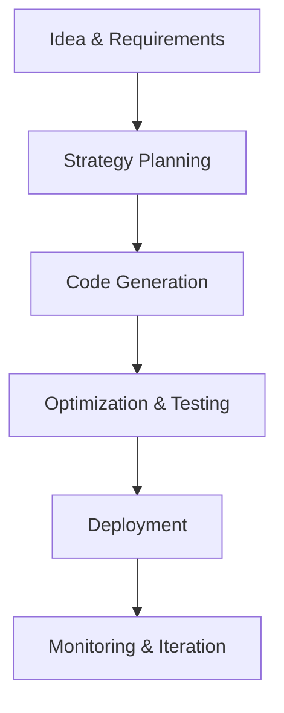

## Overview

AlisX revolutionizes software development with its AI-native platform. You define your idea, and AlisX handles the rest—from strategy to deployment. Unlike traditional tools, AlisX integrates AI across the entire lifecycle, enabling you to build high-impact applications faster.

The platform unites strategy and engineering teams through intelligent automation. You input requirements in natural language, and AI generates optimized code, architectures, and deployments.

<Callout kind="info">
  AlisX supports full-stack applications in languages like JavaScript, Python, and Go.
</Callout>

## AI-Powered Development Lifecycle

AlisX structures development into seamless stages powered by AI.



This lifecycle ensures you move from concept to production in hours, not weeks.

## Key Components

AlisX breaks development into three core pillars.

<Columns cols={3}>
  <Card title="Strategy" icon="brain" href="#strategy">
    AI analyzes your requirements and generates project roadmaps, user stories, and architecture diagrams.
  </Card>
  <Card title="Engineering" icon="code" href="#engineering">
    Generate, review, and iterate on production-ready code with AI assistance.
  </Card>
  <Card title="Deployment" icon="rocket" href="#deployment">
    One-click deploys to cloud providers with auto-scaling and monitoring.
  </Card>
</Columns>

## How AI Assists in Code Generation and Optimization

AI in AlisX excels at creating and refining code. You describe features, and it outputs complete modules.

<Tabs>
  <Tab title="Code Generation" icon="sparkles">
    Prompt AI with natural language to generate components.

    <CodeGroup tabs="TypeScript,Python">
    ```typescript
    // Generated React component for user dashboard
    import React from 'react';

    interface User {
      id: string;
      name: string;
      email: string;
    }

    const UserDashboard: React.FC<{ user: User }> = ({ user }) => {
      return (
        <div className="dashboard">
          <h1>Welcome, {user.name}!</h1>
          <p>Email: {user.email}</p>
        </div>
      );
    };

    export default UserDashboard;
    ```
    ```python
    # Generated FastAPI endpoint for user management
    from fastapi import FastAPI
    from pydantic import BaseModel

    app = FastAPI()

    class User(BaseModel):
        id: str
        name: str
        email: str

    @app.post("/users/")
    async def create_user(user: User):
        return {"message": f"User {user.name} created"}
    ```
    </CodeGroup>
  </Tab>
  <Tab title="Optimization" icon="zap">
    AI reviews code for performance and suggests improvements.

    <Callout kind="tip">
      Run AI optimization on generated code to reduce bundle size by up to 40%.
    </Callout>
  </Tab>
</Tabs>

## Project Structure and Workflows

AlisX enforces a standardized project structure for consistency.

<Steps>
  <Step title="Initialize Project" icon="plus">
    Create a new project via the dashboard.

````bash
alisx init my-app --template react
````

  </Step>
  <Step title="Define Requirements" icon="edit">
    Input features using natural language prompts.
  </Step>
  <Step title="Generate & Review" icon="play">
    AI builds the app; you iterate with feedback.
  </Step>
  <Step title="Deploy" icon="upload-cloud">
    Deploy with one command.

````bash
alisx deploy --env production
````

  </Step>
</Steps>

## Differences from Traditional Platforms

AlisX stands apart from tools like GitHub Copilot or Vercel.

| Aspect              | Traditional Platforms                  | AlisX                              |
|---------------------|----------------------------------------|------------------------------------|
| AI Scope            | Code completion only                   | Full lifecycle automation          |
| Team Integration    | Siloed tools                           | Unified strategy + engineering     |
| Deployment          | Manual CI/CD setup                     | AI-optimized one-click deploys     |
| Optimization        | Manual reviews                         | Continuous AI-driven improvements  |

<Expandable title="Advanced Workflow Customization" default-open="false">
  Customize workflows by extending AI prompts or integrating custom CI/CD pipelines. For example, add a post-generation hook:

````javascript
// hooks/post-generate.js
module.exports = async ({ projectPath }) => {
  console.log(`Project generated at {projectPath}`);
};
````
</Expandable>

This foundation empowers you to build confidently with AlisX.