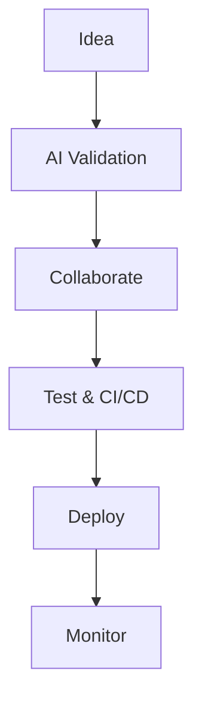

## Overview

AlisX empowers your team to build AI-native software faster by integrating strategy, engineering, and deployment into one platform. You start with AI-assisted idea validation, collaborate seamlessly, automate testing, deploy at scale, and monitor performance—all in a unified workflow. This guide covers the core features with practical examples to help you leverage AlisX effectively.



## Key Features

Discover the platform's strengths through these core capabilities. Each feature accelerates your development lifecycle.

<Columns cols={2}>
  <Card title="AI-Assisted Idea Validation" icon="zap" href="#ai-validation">
    Validate concepts with AI insights before coding begins.
  </Card>
  <Card title="Collaborative Tools" icon="users" href="#collaboration">
    Unite strategy and engineering teams in real-time.
  </Card>
  <Card title="Automated Testing & CI/CD" icon="play-circle" href="#testing">
    Streamline quality assurance with zero configuration.
  </Card>
  <Card title="Scalable Deployment" icon="rocket" href="#deployment">
    Deploy to any cloud with one command.
  </Card>
  <Card title="Performance Monitoring" icon="bar-chart" href="#monitoring">
    Gain actionable analytics on your applications.
  </Card>
</Columns>

## AI-Assisted Idea Validation and Planning

Use AlisX's AI to score your ideas based on market fit, technical feasibility, and ROI. Submit a description, and get instant reports with recommendations.

<Steps>
  <Step title="Submit Idea" icon="edit-3">
    Create a new project in the dashboard.
  </Step>
  <Step title="Run Validation" icon="zap">
    Click "Validate with AI" to analyze.
  </Step>
  <Step title="Review Report" icon="file-text">
    Access scores and improvement suggestions.
  </Step>
</Steps>

<Callout kind="tip">
  Focus on high-scoring ideas (`>80%` feasibility) to maximize success rates.
</Callout>

## Collaborative Tools for Teams

AlisX bridges strategy and engineering with shared canvases, real-time comments, and version control for plans.

<Tabs>
  <Tab title="Strategy View" icon="lightbulb">
    Define requirements and epics visually.
  </Tab>
  <Tab title="Engineering View" icon="code">
    Track tasks linked to AI-generated specs.
  </Tab>
</Tabs>

## Automated Testing and CI/CD Pipelines

AlisX auto-generates tests and sets up CI/CD. Connect your repo, and pipelines run on every commit.

<CodeGroup tabs="GitHub Actions,Docker">
  ```yaml
  name: AlisX CI/CD
  on: [push]
  jobs:
    test:
      runs-on: ubuntu-latest
      steps:
        - uses: actions/checkout@v4
        - name: Run AlisX Tests
          run: npx alisx test --api-key ${{ secrets.ALISX_API_KEY }}
  ```
  ```dockerfile
  # Dockerfile for AlisX integration
  FROM node:20
  RUN npm install -g @alisx/cli
  COPY . .
  CMD ["alisx", "deploy", "--env", "production"]
  ```
</CodeGroup>

## Scalable Deployment Options

Deploy to multiple clouds with AlisX's unified CLI. Choose your provider and scale effortlessly.

<Tabs>
  <Tab title="AWS" icon="cloud">
    ```bash
    alisx deploy --provider aws --cluster prod --auto-scale
    ```
  </Tab>
  <Tab title="Kubernetes" icon="server">
    ```bash
    alisx deploy --provider k8s --namespace alisx-app --replicas 3
    ```
  </Tab>
</Tabs>

## Performance Monitoring and Analytics

Track metrics like latency (`<100ms` targets), error rates, and user sessions in real-time dashboards.

<Expandable title="Advanced Analytics Setup" default-open="false">
  Integrate with your API:
  ```javascript
  const alisx = require('@alisx/sdk');
  const monitor = new alisx.Monitor({ apiKey: 'YOUR_API_KEY' });
  
  app.use((req, res, next) => {
    const start = Date.now();
    res.on('finish', () => {
      monitor.track('response_time', { duration: Date.now() - start });
    });
    next();
  });
  ```
</Expandable>

<Columns cols={2}>
  <Card title="Quickstart" icon="book-open" href="/quickstart">
    Get started in 5 minutes.
  </Card>
  <Card title="API Reference" icon="api" href="/authentication">
    Integrate programmatically.
  </Card>
</Columns>