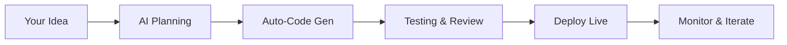

## Overview

AlisX transforms how you build AI-native software. As the core platform from Alis Exchange, it unites strategy and engineering teams to accelerate the entire lifecycle—from ideation to deployment. You input your business ideas, and AlisX's AI handles planning, coding, testing, and launching, delivering high-value applications with unprecedented speed.

Whether you lack technical expertise or need to scale development, AlisX empowers you to create production-ready software confidently. No more silos between vision and execution.

<Callout kind="info">
AlisX supports teams of all sizes, integrating seamlessly with your existing tools like GitHub, Slack, and cloud providers.
</Callout>

## Key Features

AlisX stands out with powerful capabilities designed for modern development.

<Columns cols={3}>
  <Card title="AI-Powered Ideation" icon="zap" href="#quick-start">
    Turn vague ideas into detailed specs and prototypes automatically.
  </Card>
  <Card title="End-to-End Automation" icon="rocket" href="/quickstart">
    Automate coding, testing, and deployment in one unified workflow.
  </Card>
  <Card title="Team Collaboration" icon="users" href="/configuration">
    Real-time sync between strategy docs and engineering codebases.
  </Card>
</Columns>

## Who Should Use AlisX

<ExpandableGroup>
  <Expandable title="Strategy and Product Teams" default-open="true">
    You define requirements without writing code. AlisX generates actionable plans, wireframes, and user stories from natural language inputs.
  </Expandable>
  <Expandable title="Engineering Teams">
    Leverage AI to handle boilerplate, focus on innovation, and iterate 10x faster.
  </Expandable>
  <Expandable title="Startups and Enterprises">
    Scale from MVP to enterprise-grade apps without hiring large dev teams.
  </Expandable>
</ExpandableGroup>

## How AlisX Integrates Strategy and Engineering

AlisX bridges the gap with a unified workflow.



Strategy inputs flow directly into engineering outputs, eliminating miscommunication.

## Quick Start

Get up and running in minutes.

<Steps>
  <Step title="Sign Up" icon="user-plus">
    Create your account at `https://dashboard.example.com/signup` using your email.
  </Step>
  <Step title="Create Project" icon="plus">
    Start a new project and describe your app idea.
  </Step>
  <Step title="Generate & Deploy" icon="rocket">
    Review AI-generated code and deploy with one click.
  </Step>
</Steps>

<CodeGroup tabs="JavaScript,Python">
```javascript
// Example: Fetch your first project
const response = await fetch('https://api.example.com/v1/projects', {
  headers: { Authorization: `Bearer ${YOUR_API_KEY}` }
});
const projects = await response.json();
console.log(projects);
```
```python
# Example: List projects via API
import requests
response = requests.get(
    'https://api.example.com/v1/projects',
    headers={'Authorization': f'Bearer {YOUR_API_KEY}'}
)
projects = response.json()
print(projects)
```
</CodeGroup>

## Next Steps

<Columns cols={2}>
  <Card title="Quickstart Guide" icon="book-open" href="/quickstart">
    Dive into detailed setup and your first full app.
  </Card>
  <Card title="Authentication" icon="lock" href="/authentication">
    Secure your API access and manage teams.
  </Card>
  <Card title="Configuration" icon="settings" href="/configuration">
    Customize workflows for your needs.
  </Card>
  <Card title="Changelog" icon="git-branch" href="/changelog">
    Stay updated with latest features.
  </Card>
</Columns>

<Callout kind="tip">
Ready to build? Head to the [Quickstart](/quickstart) for hands-on guidance.
</Callout>